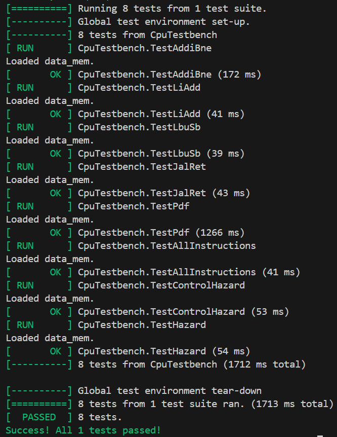

# RISC-V

# Table of Contents:

- [Quick Start](#quick-start)
- [Single Cycle CPU Implementation](#single-cycle)
- [Pipelined CPU Implementation](#pipelined-risc-v-cpu)
- [Cached Implementation](#data-memory-cache)
- [Complete RISC-V](#complete-riscv-cpu)
- [Superscalar](#superscalar)
- [Dynamic Branch Prediction](#dynamic-branch-prediction)
- [Appendix](#appendix)

# Quick Start
This repository contains our complete implementation of a RISC-V RV32I processor with several major design iterations.

We completed the Single-Cycle and all of the stretch goals (Pipelined, Two-Way Set Associative Write-Back Cache, Full RV32I Design). We further enhanced the design with the **Superscalar** and **Dynamic Branch Prediction**.

| Branch | Description |
| ------ | ----------- |
|`main` | Full 32VI Single-Cycle Implementation |
|`Pipelined` | Pipelined + Full RV32I Implementation |
|`Cache` | Cache + Full 32VI Single-Cycle Implementation |
|`Complete` | Pipelined + Cache + Full RV32I Implementation |
|`Superscalar` | Superscalar Implementation |
|`Branch-Predict` | Pipelined + Full RV32I + Branch Prediction Implementation |


### Prerequisites

- **Verilator** (version 4.0 or higher)
- **RISC-V GNU Toolchain** (for assembly compilation)
- **GTKWave** (for waveform viewing)
- **GoogleTest** (for C++ testbenches)
- **Vbuddy** (optional, for F1 and PDF demonstrations)

### Quick Build & Test

To access each implementation version:

```bash
git checkout <branch-name>
```

**IMPORTANT:** All testbench scripts must be run from the `/tb` directory.

#### Running Provided Test Suite

```bash
cd tb
./doit.sh
```

You will be given the option to execute:

- **Unit Tests** (testbenches we have written to verify the logic of individual modules).
- **Program Tests** (verifies execution of test programs to ensure the processor meets requirements).
- **Vbuddy Tests** (to run files with Vbuddy hardware integration implemented).

The distribution for the pdf test can be changed by overwriting the distribution name.

To do this in `./tb/program_tests/verify.cpp`, change line 43.
```cpp
// can change to "noisy", "triangle", or "sine"
setData("reference/gaussian.mem");
```

To do this in `./tb/vbuddy_tests/execute_pdf.cpp`, change line 144.
```cpp
// can change to "noisy", "triangle", or "sine"
tb.setData("reference/gaussian.mem");
```
The execute_pdf.cpp program also allows you to skip vbuddy clock cycle plotting to a specific target in order to save execution time. The suggested thresholds for each datasource are hardcoded in lines 18-22. Uncomment the appropriate line depending on your datasource.

For unit testing modules individually, we run:
```bash
cd tb
./doit.sh unit_tests/<"test name">.cpp
```
This will run the individual unit tests.

The same syntax applies for running any testbench in any folder, and the doit.sh can handle multiple .cpp files as arguments. Simply enter them one after another, seperated by a space.

#### Quick Start - Vbuddy Tests

##### **Windows only**: the doit.sh script automatically attempts to run the attach_usb.sh script on execution in order to pair to vbuddy if connected.

To run the f1 light test within the `./tb/` folder,

```bash
cd tb
./doit.sh program_tests/execute_f1.cpp
```


## Team Members & Contributions

### Team Details

| Team Member | GitHub | CID | Email | Personal Statement |
|-------------|--------|-----|-------|-------------------|
| [Team Member 1] | [@Asad-Tar1q](https://github.com/Asad-Tar1q)| [02582153] | [aut24@ic.ac.uk] | [Link to Statement](./statements/Asad.md) |
| [Team Member 2] | [@Marc0s-ikp](https://github.com/Marc0s-ikp) | [02415338] | [mi624@ic.ac.uk] | [Link to Statement](./statements/Marcus.md) |
| [Team Member 3] | [@NabeelHimaz](https://github.com/NabeelHimaz) | [02605511] | [nh1324@ic.ac.uk] | [Link to Statement](./statements/Nabeel.md) |
| [Team Member 4] | [@archit-ku](https://github.com/archit-ku) | [02560961] | [ak2324@ic.ac.uk] | [Link to Statement](./statements/Archit.md) |


# Single Cycle

### Overview

The single-cycle implementation forms the foundation of our RISC-V processor, executing each instruction in a single clock cycle. This version implements the complete RV32I base instruction set, providing support for:

- **R-type:** Arithmetic and logical operations
- **I-type:** Immediate operations 
- **S-type:** Store operations
- **B-type:** Conditional branches
- **U-type:** Upper immediate operations
- **J-type:** Unconditional jumps

### Architecture Diagram


### Supported Instructions

| Instruction Type | Instructions Implemented |
|-----------------|-------------------------|
| **R-type** | `add`, `sub`, `xor`, `or`, `and`, `sll`, `srl`, `sra`, `slt`, `sltu` |
| **I-type (ALU)** | `addi`, `xori`, `ori`, `andi`, `slli`, `srli`, `srai`, `slti`, `sltiu` |
| **I-type (Load)** | `lb`, `lh`, `lw`, `lbu`, `lhu` |
| **I-type (Jump)** | `jalr` |
| **S-type** | `sb`, `sh`, `sw` |
| **B-type** | `beq`, `bne`, `blt`, `bge`, `bltu`, `bgeu` |
| **U-type** | `lui`, `auipc` |
| **J-type** | `jal` |

### Module Breakdown


### Key Design Decisions

1. **Top Module Stages:**
Since we knew we would be implementing pipelining soon, we divided our top into 5 different stages: `fetch.sv`, `decode.sv`, `execute.sv`, `memoryblock.sv`, `writeback.sv`.

2. **ALU Control Logic:**
   -   We implemented a **single-level decode architecture** where the control unit directly generates all ALU control signals from the instruction's `opcode`, `funct3`, and `funct7` fields in one combinational step, rather than using a two-level decode with an intermediate ALU decoder. This simplified the control logic and reduced decode latency at the cost of a slightly more complex control unit.


### Contributions

| Module                        | Asad | Nabeel | Marcus | Archit |
|-------------------------------|:----:|:------:|:------:|:------:|
| ALU.sv                        |  X   |        |        |        |
| controlunit.sv                |      |    X    |        |        |
| data_mem.sv                   |      |        |   X    |        |
| data_mem_i.sv                 |      |        |   X    |        |
| data_mem_o.sv                 |      |        |   X    |        |
| data_mem_top.sv               |      |        |   X    |        |
| extend.sv                     |  X    |        |        |        |
| instrmem.sv                   |      |       |    X    |        |
| pc_module.sv                  |   X   |       |        |        |
| regfile.sv                    |  X    |        |        |        |
| top.sv                        |  C   |   X    |    C    |       |
| System Testing & Debugging   |      |        |        |   X    |
| PDF Testing                  |      |        |        |   X    |
| F1 Testing                   |      |        |        |   X    |

`X` - Lead Contributor  `C` - Contributor

## File Structure

```
[NEED TO DO]
```

The processor development is done in the register transfer level (`rtl`) folder and the testing is performed in the test bench folder (`tb`).
The test bench folder contains:
- Assembly files (1 to 5 provided and f1.s)
- `assemble.sh` - translating RISCV assembly to machine code
- `doit.sh` - master script that handles the top level execution of the unit tests and test programs.
- Unit tests
- Program tests
- Vbuddy tests

Note: only for this version, is the `tb` folder shown, this contains the tests and shows all other execution files

## Implementation
Instructions implemented:

| Type     | Instruction                                                    |
| -------- | -------------------------------------------------------------- |
| R        | `add` `sub` `xor` `or` `and` `sll` `srl` `sra` `slt` `sltu`    |
| I (ALU)  | `addi` `xori` `ori` `andi` `slli` `srli` `srai` `slti` `sltiu` |
| I (load) | `lbu` `lw`                                                     |
| I (jump) | `jalr`                                                         |
| S        | `sb` `sw`                                                      |
| B        | `beq` `bne`                                                    |
| U        | `lui`                                                          |
| J        | `jal`                                                          |

## Testing
### Test cases
##### Note: if any of the videos fail to load, please find the videos in `./images/vbuddy_tests/`

For the tests provided (`1_addi_bne` `2_li_add` `3_lbu_sb` `4_jal_ret` `5_pdf`):

### Single cycle testing


### F1
https://github.com/user-attachments/assets/d6e40790-56d4-4d95-b67c-37f45b6d86d5

### PDF: Gaussian
https://github.com/user-attachments/assets/78df51d1-e5ad-4024-bef0-96da9c50b70a

### PDF: Noisy
https://github.com/user-attachments/assets/eef1a4e2-7991-4c1d-afa6-7ff94e41b589

### PDF: Triangle
https://github.com/user-attachments/assets/07633f81-343f-42c6-8fd5-e5dfc97a4d0a

### PDF: Sine
https://github.com/user-attachments/assets/fc73e31b-ed6a-421a-bb6c-efd21d2088e7

---
# Pipelined RISC-V CPU

## Overview
The pipelined implementation supports the full RV32I instruction set, dividing the processor into five main stages: fetch, decode, execute, memory and writeback. The fundamental principle of pipelining is parallel instruction execution, where different stages of multiple instructions are processed simultaneously. This architecture achieves higher throughput by overlapping the execution of multiple instructions, though at the cost of increased complexity in hazard detection and resolution. Together, these improvements result in faster program execution compared to the single-cycle variant.

**Pipeline Stages:**

1. **Fetch (F)**: Retrieves instruction from memory
2. **Decode (D)**: Decodes instruction and reads registers  
3. **Execute (E)**: Performs ALU operations and computes addresses
4. **Memory (M)**: Accesses data memory for loads/stores
5. **Writeback (W)**: Writes results back to register file

## Schematic


## Contributions

| Module / Task               | Asad | Nabeel | Marcus | Archit |
|-----------------------------|:----:|:------:|:------:|:------:|
| fetch.sv                    |  X   |        |        |        |
| decode.sv                   |  X   |        |        |        |
| execute.sv                  |  X   |   C    |        |        |
| memoryblock.sv              |      |   X    |        |        |
| writeback.sv                |      |   X    |        |        |
| top.sv                      |  C   |   C    |   C     |        |
| hazardunit.sv               |     |    X    |        |        |
| pipereg_FD_1.sv            |      |        |   X    |        |
| pipereg_DE_1.sv              | X     |        |   C     |        |
| pipereg_EM_1.sv             |      |        |   X    |        |
| pipereg_MW_1.sv             |      |        |    X    |        |
| System Testing & Debugging  |      |        |        |   X    |
| PDF Testing                 |      |        |        |   X    |
| F1 Testing                  |      |        |        |   X    |

`X` - Lead Contributor   `C` - Contributor
## File Structure
```
RISCV-Team04/
│
├── rtl/
│   ├── ALU.sv
│   ├── controlunit.sv
│   ├── data_mem.sv
│   ├── data_mem_i.sv
│   ├── data_mem_o.sv
│   ├── data_mem_top.sv
│   ├── decode.sv
│   ├── execute.sv
│   ├── extend.sv
│   ├── fetch.sv
│   ├── hazardunit.sv
│   ├── instrmem.sv
│   ├── memoryblock.sv
│   ├── mux.sv
│   ├── pc_module.sv
│   ├── pipereg_DE_1.sv
│   ├── pipereg_EM_1.sv
│   ├── pipereg_FD_1.sv
│   ├── pipereg_MW_1.sv
│   ├── program.hex
│   ├── regfile.sv
│   ├── top.sv
│   └── writeback.sv
│
├── tb/
│   ├── asm/
│   │   ├── 1_addi_bne.s
│   │   ├── 2_li_add.s
│   │   ├── 3_lbu_sb.s
│   │   ├── 4_jal_ret.s
│   │   ├── 5_pdf.s
│   │   ├── 6_all_instructions.s
│   │   ├── 7_control_hazards.s
│   │   └── 8_hazards.s
│   │
│   ├── reference/
│   │   ├── gaussian.mem
│   │   └── pdf.asm
│   │
│   ├── our_tests/
│   │   ├── ALU_tb.cpp
│   │   ├── base_testbench.h
│   │   ├── controlunit_tb.cpp
│   │   ├── cpu_testbench.h
│   │   ├── data_mem_1_tb.cpp
│   │   ├── data_mem_0_tb.cpp
│   │   ├── data_mem_tb.cpp
│   │   ├── data_mem_top_tb.cpp
│   │   └── verify.cpp
│   │
│   ├── assemble.sh
│   ├── doit.sh
│   ├── testall.sh
│   └── .gitignore
│
├── statements/
│   ├── Archit.md
│   ├── Asad.md
│   └── Nabeel.md
│   └── Marcus.md
│
├── .gitignore
└── README.md
```
## Implementation
Transitioning from single-cycle to pipelined introduces various significant changes to the design structure. Combined with the full RV32I instruction set, there are many new modules and concepts in the pipelined version.

### Implementation Details

1. **Pipeline Registers:**
   - Four pipeline registers separate the five processor stages: Fetch/Decode (FD), Decode/Execute (DE), Execute/Memory (EM), and Memory/Writeback (MW)
   - Store all instruction data, control signals, and intermediate results required for the next stage

2. **Enhanced Control Unit Signals:**
   - **Branch/Jump Flags:** Determine branch evaluation and control flow changes in the execute stage
   - **UpperOp Flag:** Enables upper immediate operations for LUI and AUIPC instructions
   - **Memory Operation Flags:** Drive the load/store parsing unit for correct byte/halfword/word handling
   - All control signals propagate through pipeline registers to maintain instruction context

3. **Branch Resolution:**
   - Branch decisions made in the execute stage using ALU comparison results
   - Branch target address calculated using dedicated adder (PC + sign-extended immediate)
   - One-cycle branch penalty when branch is taken due to instruction fetch already in progress

4. **Hazard Detection Unit:**
   - **Data Hazard Detection:** Compares source register addresses in decode/execute stages with destination registers in execute/memory/writeback stages
   - **Forwarding Paths:** Three forwarding multiplexers route correct data (EX/MEM result, MEM/WB result, or register file data) to ALU inputs
   - **Stalling:** Inserts NOPs when load-use hazard detected (data needed before available from memory)
   - Forwarding priorities: Most recent result takes precedence (EX/MEM → MEM/WB → Register File)

5. **Pipeline Flushing:**
   - Converts instructions in fetch and decode stages to NOPs when branch/jump taken
   - Prevents incorrect instructions from executing after control flow change
   - Implemented by clearing control signals in FD and DE pipeline registers


## Testing
### Test Cases: 1-5
For the tests provided in the repo `tb` file, (`1_addi_bne` `2_li_add` `3_lbu_sb` `4_jal_ret` `5_pdf`):


We also ran the same `pdf` and `f1_fsm` tests on Vbuddy, and observed the similar outputs as in single-cycle.

---
# Data Memory Cache

## Overview

Cache memory in RISC-V employs direct-mapped, set-associative, or fully associative mapping to determine data placement, in this implementation we utilise 2-way set associative cache.
**Tags** and **valid bits** identify cached data, while **replacement policies** like LRU handle evictions. Write policies such as **write-through** and **write-back** manage consistency between cache and memory.
These techniques ensure efficient data access, reducing latency and leveraging locality principles for optimised performance.  

## Contributions

| Module / Task                | Asad | Marcus |
|------------------------------|------|--------|
| data_cache.sv                |      |   X    |
| memoryblock.sv               |   X  |        |
| Single-cycle cache           |   X  |   C    |
| Pipelined cache              |      |   X    |
| System Testing & Debugging   |   C  |   X    |
   

`X` - Lead Contributor   `C` - Contributor
## File Structure
```
.
├── rtl
│   ├── adder.sv
│   ├── decode
│   │   ├── control.sv
│   │   ├── decode_top.sv
│   │   ├── reg_file.sv
│   │   └── signextend.sv
│   ├── execute
│   │   ├── alu.sv
│   │   └── execute_top.sv
│   ├── fetch
│   │   ├── fetch_top.sv
│   │   ├── instr_mem.sv
│   │   └── pc_register.sv
│   ├── memory
│   │   ├── memory_top.sv
│   │   ├── ram2port.sv
│   │   ├── sram.sv
│   │   ├── two_way_cache_controller.sv
│   │   └── two_way_cache_top.sv
│   ├── mux.sv
│   ├── mux_4x2.sv
│   └── top.sv
└── tb
```
## Implementation
The two-way set-associative cache design consists of the following components:

1. **Cache Controller**:
    - **Associativity**: 2-Way Set Associative.
    - **Addressing**: 512 Sets (indexed by address bits `[10:2]`) with 21-bit Tags (address bits `[31:11]`).
    - **Replacement Policy**: **LRU (Least Recently Used)**. A single bit per set tracks which way was accessed last to determine the victim on eviction.
    - **Write Policy**: **Write-Through, Write-No-Allocate**.
        - **Write Hit**: Data is updated in the cache and simultaneously written to main memory to ensure consistency.
        - **Write Miss**: Data is written directly to main memory without allocating a line in the cache.
    - **Read Policy**:
        - **Read Miss**: Data is fetched from main memory and allocated into the cache, evicting the Least Recently Used block if the set is full.

2. **Top Module (Memory Subsystem)**:
    - Acts as the interface between the CPU pipeline and the memory hierarchy.
    - Integrates the `data_cache` with the main `data_mem` RAM.
    - **Data Alignment**: Instantiates `data_mem_i` and `data_mem_o` to handle sub-word operations (`LB`, `LH`, `SB`, `SH`). Byte manipulation happens *before* the cache for stores and *after* the cache for loads, allowing the cache to store full aligned 32-bit words.

3. **Cache Structure**:
    - **Storage Arrays**:
        - `data_array`: Stores 32-bit data words.
        - `tag_array`: Stores 21-bit address tags.
        - `valid_array`: Tracks if a cache line contains valid data.
        - `lru_array`: Stores replacement state.
    - **Capacity**: 512 sets × 2 ways × 4 bytes = 4 KB of fast-access storage.

This implementation reduces average memory access time while maintaining simplified coherency through the Write-Through policy, avoiding the complexity of Dirty bits and Write-Back buffers.

## Testing

  For unit testing, we initially setup the environment to provide clear debug information and supports waveform analysis for issue tracking with gtkwave and also outputting variable status in between. We were then able to analyse the following through test cases:
- Basic read and write operations perform correctly in isolation.
- Proper handling of read and write hits for word and byte addressing.
- Eviction Logic
- Write Miss Handling
- LRU Replacement policy and fetching from memory


---
# Complete RISCV CPU

## Overview
The complete system integration for a RISC-V project involves implementing all instructions defined by the RISC-V instruction set architecture.
Here, we integrate a cache system to enhance memory access speed and reduce latency (seen in the `cache` branch). 
Pipelining is incorporated to improve throughput by enabling the concurrent execution of multiple instructions (from `pipelined` branch).  
The design ensures that each component, including the cache and pipeline, operates cohesively for optimal performance. This integration results in a high-performance RISC-V processor capable of handling complex tasks efficiently.

## Contributions


`X` - Lead Contributor   `C` - Contributor
## File Structure
```
RISCV-Team04/
│
├── rtl/
│   ├── ALU.sv
│   ├── controlunit.sv
│   ├── data_cache.sv
│   ├── data_mem.sv
│   ├── data_mem_i.sv
│   ├── data_mem_o.sv
│   ├── data_mem_top.sv
│   ├── decode.sv
│   ├── execute.sv
│   ├── extend.sv
│   ├── fetch.sv
│   ├── hazardunit.sv
│   ├── instrmem.sv
│   ├── memoryblock.sv
│   ├── mux.sv
│   ├── pc_module.sv
│   ├── pipereg_DE_1.sv
│   ├── pipereg_EM_1.sv
│   ├── pipereg_FD_1.sv
│   ├── pipereg_MW_1.sv
│   ├── program.hex
│   ├── regfile.sv
│   ├── top.sv
│   └── writeback.sv
│
├── tb/
│   ├── asm/
│   │   ├── 1_addi_bne.s
│   │   ├── 2_li_add.s
│   │   ├── 3_lbu_sb.s
│   │   ├── 4_jal_ret.s
│   │   ├── 5_pdf.s
│   │   ├── 6_all_instructions.s
│   │   ├── 7_control_hazards.s
│   │   └── 8_hazards.s
│   │
│   ├── reference/
│   │   ├── gaussian.mem
│   │   └── pdf.asm
│   │
│   ├── our_tests/
│   │   ├── ALU_tb.cpp
│   │   ├── base_testbench.h
│   │   ├── controlunit_tb.cpp
│   │   ├── cpu_testbench.h
│   │   ├── data_mem_1_tb.cpp
│   │   ├── data_mem_0_tb.cpp
│   │   ├── data_mem_tb.cpp
│   │   ├── data_mem_top_tb.cpp
│   │   └── verify.cpp
│   │
│   ├── assemble.sh
│   ├── doit.sh
│   ├── testall.sh
│   └── .gitignore
│
├── statements/
│   ├── Archit.md
│   ├── Asad.md
│   └── Nabeel.md
│   └── Marcus.md
│
├── .gitignore
└── README.md
```

Only key relevant files are shown over here.

## Implementation
The implementation of the complete version remains structurally similar to the pipelined, full RV32I version. Note that with the addition of cache, the CPU now stalls upon a cache miss in order to better emulate a real-world processsor.

## Testing
### Test Cases 1-8
Similar to pipelined, test cases 1-8 assess the full RV32I instruction set for the complete version. We added tests surrounding hazards and the control unit which were heavily affected by the pipelining changes. 



All tests pass as expected.

We also ran the same `pdf` and `f1_fsm` tests on Vbuddy, and observed the similar outputs as in single-cycle.

---
# Superscalar
## Overview

A simplified superscalar RISC-V processor that can execute two independent instructions simultaneously in a single clock cycle, achieving up to 2x throughput compared to a traditional scalar processor.

### Implementation 

**Supported Instructions:**
- R-type: ADD, SUB, AND, OR, XOR, SLL, SRL, SRA, SLT, SLTU
- I-type ALU: ADDI, ANDI, ORI, XORI, SLLI, SRLI, SRAI, SLTI, SLTIU

**Architectural Simplifications:**
- No memory operations (loads/stores) - eliminates data memory and associated hazards
- No branches or jumps - removes control hazard complexity
- Simplified datapath focused on register-to-register operations

### Design Benefits

This reduced instruction set enabled:
1. **Cleaner dual-issue logic** - both ALUs can operate independently without memory port conflicts
2. **Simplified hazard detection** - only RAW (Read-After-Write) hazards between register operations
3. **Streamlined dependency checking** - no load-use hazards or memory ordering concerns

### Hardware Implementation

Key components for dual-issue execution:
- **Dual ALUs** - Two independent arithmetic/logic units for parallel computation
- **Register File** - Four read ports (two per instruction) and two write ports
- **Instruction Fetch** - Fetches two instructions per cycle
- **Result Writeback** - Simultaneous writes to different destination registers

# Dynamic Branch Prediction

## Overview

To mitigate the performance impact of control hazards in our pipelined architecture, we implemented a **Dynamic Branch Predictor** using a Branch Target Buffer (BTB).

## Architecture

- **Branch Target Buffer (BTB):** A direct-mapped cache (64 entries) that stores the target address for branch instructions. It is indexed by the lower bits of the PC.
- **Saturating Counters:** Each BTB entry maintains a 2-bit state machine (Strongly Not Taken, Weakly Not Taken, Weakly Taken, Strongly Taken) to predict the branch outcome based on local history.

## Operation

1. **Fetch Stage Prediction:** The Fetch unit queries the BTB using the current PC. If a valid entry exists and the counter predicts "Taken," the PC is immediately updated to the target address, avoiding a pipeline bubble.
2. **Execute Stage Verification:** The Execute unit resolves the actual branch outcome. It compares this against the prediction passed down the pipeline (`PredictTakenE`).
3. **Misprediction Recovery:** If the prediction was incorrect:
   - The pipeline is flushed (FlushD, FlushE).
   - The PC is corrected:
     - If we predicted Taken but shouldn't have: Redirect to `PC + 4`.
     - If we predicted Not Taken but should have: Redirect to the calculated Branch Target.
   - The BTB entry is updated with the new target and the counter is adjusted.

# Appendix
### A. Design Philosophy & Decisions

#### Modular Design Approach

Our design emphasizes modularity and reusability:

1. **Clear Interfaces:** Each module has well-defined inputs/outputs
2. **Hierarchical Structure:** Top-level modules composed of sub-modules
3. **Parameterisation:** Configurable data widths and memory sizes
4. **Encapsulation:** Internal signals hidden from parent modules

#### Coding Standards

We followed industry best practices:

- **Naming Conventions:**
  - `_i` suffix for module inputs
  - `_o` suffix for module outputs
  
- **Documentation:**

  - Inline comments for complex logic
  - Signal descriptions in port lists

- **Version Control:**
  - Meaningful commit messages
  - Feature branches for major changes
  - Code reviews before merging

### B. References & Resources
  #### Official RISC-V Documentation

- [RISC-V Specification v2.2](https://riscv.org/wp-content/uploads/2017/05/riscv-spec-v2.2.pdf)
- [RISC-V Instruction Set Manual](https://github.com/riscv/riscv-isa-manual)


#### Textbooks

- *Computer Organization and Design: RISC-V Edition* by Patterson & Hennessy
- *Digital Design and Computer Architecture: RISC-V Edition* by Harris & Harris

