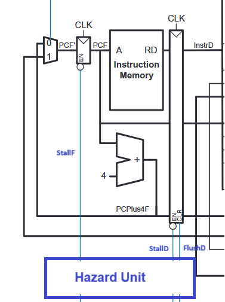
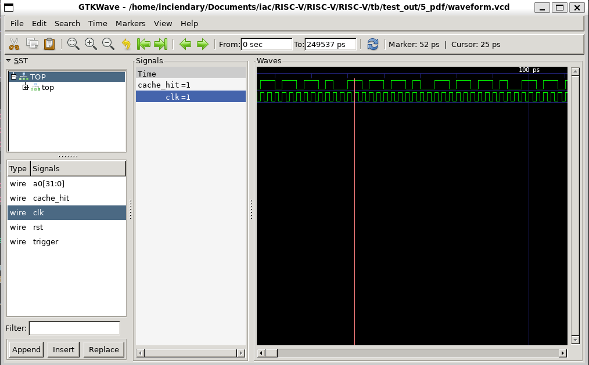

# Personal Statement

#### *Asad Tariq | CID: 02582153 | GitHub: Asad-Tar1q*

This document offers a detailed account of my work on the RISC-V project. It highlights the tasks I completed, the methodologies I followed, the reasoning behind significant design choices, and the approaches taken to overcome various challenges. It also reflects on the mistakes made throughout the process, how they were resolved, and the key insights and lessons gained from the overall experience.

---

## Overview of Contributions

### [**Single Cycle Full RV32I**](#single-cycle-1)
- PC Module
- Instruction Memory
- ALU
- Extend
- Top Integration 
### [**Pipelined + Full RV32I**](#pipelined--full-rv32i-1)
- Fetch Stage [commit](https://github.com/NabeelHimaz/RISCV-Team04/commit/d4e13ea856879a5bd7e5baffe6ba4b12e2aecf51)
- Decode Stage [commit](https://github.com/NabeelHimaz/RISCV-Team04/commit/de7c98fae0cd8cdf3a7e50e4c379c5a57703501a)
- Execute Stage [commit](https://github.com/NabeelHimaz/RISCV-Team04/commit/6da8eef32ce5f443c122d522cf2e9fe3673b3bcb)
    - 3-input muxes for forwarding stages 
    - Branch + Jump Logic 
    - Muxes for operand selection
- Integrated Hazard unit 
    - Forwarding controls (ForwardAE/BE) 
    - Stall logic
    - Flush logic 
- Helped integration, testing and debugging of pipelined processor
    - Integrate top level fetch, decode, execute, memory and write-back stages

### [**Pipelined + Full RV32I + Cache**](#pipelined--full-rv32i--cache-1)
- Integration, testing and debugging of pipelined + cached processor
    - Integrated cache module into single cycle
    - Modified top so that I could prove that cache was being hit

---


# Single Cycle Full RISC-V 32I Design

## ALU (Arithmetic Logic Unit)

### Aims
- Design a versatile ALU capable of executing all RISC-V 32I arithmetic and logic operations
- Support 10 distinct operations including addition, subtraction, bitwise operations, and shifts
- Implement efficient comparison logic for branch instructions
- Provide zero-flag and comparison outputs for branch decision logic

### Implementation

The ALU serves as the computational heart of the processor, performing all arithmetic and logical operations required by the RISC-V ISA. The module accepts two 32-bit operands and a 4-bit ALU control signal, producing a 32-bit result. Additionally, the module handles all the branching logic by taking in a 3-bit branch control signal and outputs a branch taken flag.

**Interface Design:**
```systemverilog
module alu (
    input  logic [DATA_WIDTH-1:0]   srcA_i,
    input  logic [DATA_WIDTH-1:0]   srcB_i,
    input  logic [3:0]              ALUCtrl_i,
    input logic  [2:0]              branch_i,

    output logic [DATA_WIDTH-1:0]   ALUResult_o,
    output logic                    branchTaken_o
);
```

**Operation Encoding:**

The 4-bit `ALUControl_i` signal determines which operation to perform:

| **ALUControl** | **Operation** | **Description** |
|----------------|---------------|-----------------|
| 4'b0000 | ADD | Addition: `Result = A + B` |
| 4'b0001 | SUB | Subtraction: `Result = A - B` |
| 4'b0010 | AND | Bitwise AND: `Result = A & B` |
| 4'b0011 | OR | Bitwise OR: `Result = A \| B` |
| 4'b0100 | XOR | Bitwise XOR: `Result = A ^ B` |
| 4'b0101 | SLT | Set Less Than (signed): `Result = (A < B) ? 1 : 0` |
| 4'b0110 | SLTU | Set Less Than (unsigned): `Result = (A < B) ? 1 : 0` |
| 4'b0111 | SLL | Shift Left Logical: `Result = A << B[4:0]` |
| 4'b1000 | SRL | Shift Right Logical: `Result = A >> B[4:0]` |
| 4'b1001 | SRA | Shift Right Arithmetic: `Result = A >>> B[4:0]` |


**Core Logic Implementation:**
```systemverilog
always_comb begin
    case(ALUCtrl_i)
        4'b0000: ALUResult_o = SrcA_i + SrcB_i;                    // ADD
        4'b0001: ALUResult_o = SrcA_i - SrcB_i;                    // SUB
        4'b0010: ALUResult_o = SrcA_i & SrcB_i;                    // AND
        4'b0011: ALUResult_o = SrcA_i | SrcB_i;                    // OR
        4'b0100: ALUResult_o = SrcA_i ^ SrcB_i;                    // XOR
        4'b0101: ALUResult_o = ($signed(SrcA_i) < $signed(SrcB_i)) ? 32'b1 : 32'b0;  // SLT
        4'b0110: ALUResult_o = (SrcA_i < SrcB_i) ? 32'b1 : 32'b0;  // SLTU
        4'b0111: ALUResult_o = SrcA_i << SrcB_i[4:0];              // SLL
        4'b1000: ALUResult_o = SrcA_i >> SrcB_i[4:0];              // SRL
        4'b1001: ALUResult_o = $signed(SrcA_i) >>> SrcB_i[4:0];    // SRA
        default: ALUResult_o = 32'b0;
    endcase
end
```

**Branch Support Logic:**

The ALU takes in a branch control input and generates a critical output branch flag that determines if the program branches. 

```systemverilog
    case(branch_i)
        3'b000: branchTaken_o = (srcA_i == srcB_i);                // BEQ
        3'b001: branchTaken_o = (srcA_i != srcB_i);                // BNE
        3'b100: branchTaken_o = ($signed(srcA_i) < $signed(srcB_i));   // BLT
        3'b101: branchTaken_o = ($signed(srcA_i) >= $signed(srcB_i));  // BGE
        3'b110: branchTaken_o = (srcA_i < srcB_i);                 // BLTU
        3'b111: branchTaken_o = (srcA_i >= srcB_i);                // BGEU
        default: branchTaken_o = 1'b0;                             // No branch
    endcase
end
```
The 3-bit `branch_i` signal determines which branch comparison to perform depending on operation:

| **branch_i** | **Branch Type** | **Condition** | **Description** |
|--------------|-----------------|---------------|-----------------|
| 3'b000 | BEQ | `A == B` | Branch if Equal |
| 3'b001 | BNE | `A != B` | Branch if Not Equal |
| 3'b100 | BLT | `A < B` (signed) | Branch if Less Than |
| 3'b101 | BGE | `A >= B` (signed) | Branch if Greater or Equal |
| 3'b110 | BLTU | `A < B` (unsigned) | Branch if Less Than Unsigned |
| 3'b111 | BGEU | `A >= B` (unsigned) | Branch if Greater or Equal Unsigned |


## Extend Unit (Immediate Extension)

### Aims
- Extract immediate values from RISC-V instruction encodings
- Support all five immediate formats: I-type, S-type, B-type, U-type, and J-type
- Perform proper sign extension to generate 32-bit immediates from compressed formats

### Implementation

The extend unit decodes the 32-bit instruction and extracts the immediate value based on the instruction type. Different instruction formats pack immediate bits in different positions, requiring careful extraction and reassembly.

**Interface:**
```systemverilog
module extend (
    input  logic [31:0] Instr_i,      // 32-bit instruction
    input  logic [2:0]  ImmSrc_i,     // Immediate format select
    output logic [31:0] ImmExt_o      // Sign-extended 32-bit immediate
);
```

**Immediate Format Encoding:**

| **ImmSrc** | **Format** | **Instructions** | **Bit Extraction** |
|------------|------------|------------------|-------------------|
| 3'b000 | I-type | ADDI, LW, JALR | `[31:20]` |
| 3'b001 | S-type | SW, SB, SH | `[31:25, 11:7]` |
| 3'b010 | B-type | BEQ, BNE, BLT, BGE | `[31, 7, 30:25, 11:8]` |
| 3'b011 | U-type | LUI, AUIPC | `[31:12]` |
| 3'b100 | J-type | JAL | `[31, 19:12, 20, 30:21]` |

**Implementation Logic:**

```systemverilog
always_comb begin
    case(ImmSrc_i)
        3'b000: // I-type: 12-bit immediate in bits [31:20]
            ImmExt_o = {{20{Instr_i[31]}}, Instr_i[31:20]};
            
        3'b001: // S-type: 12-bit immediate split across [31:25] and [11:7]
            ImmExt_o = {{20{Instr_i[31]}}, Instr_i[31:25], Instr_i[11:7]};
            
        3'b010: // B-type: 13-bit immediate, LSB always 0 (word-aligned)
            ImmExt_o = {{19{Instr_i[31]}}, Instr_i[31], Instr_i[7], 
                        Instr_i[30:25], Instr_i[11:8], 1'b0};
            
        3'b011: // U-type: 20-bit immediate in upper bits
            ImmExt_o = {Instr_i[31:12], 12'b0};
            
        3'b100: // J-type: 21-bit immediate, LSB always 0
            ImmExt_o = {{11{Instr_i[31]}}, Instr_i[31], Instr_i[19:12], 
                        Instr_i[20], Instr_i[30:21], 1'b0};
            
        default: 
            ImmExt_o = 32'b0;
    endcase
end
```
---

## Program Counter Module


### Implementation

The Program Counter (PC) module is a critical state element that tracks which instruction should execute next. It updates on each clock cycle, either incrementing by 4 for sequential execution or loading a branch/jump target. 

```systemverilog
module pc_module (
    input  logic        clk,          // System clock
    input  logic        rst,          // Synchronous reset
    input  logic        PCSrc_i,      // Select next PC source
    input  logic [31:0] PCTarget_i,   // Branch/jump target address
    output logic [31:0] PC_o          // Current program counter
);
```
---

## Register File


### Implementation

I also implemented the register file which worked closely with the other modules I wrote  like instruction memory and ALU. It implements a 32-entry register array with dual read ports and a single write port. 

The only thing of note is that x0 is hardwired to 0 and that must be enforced to prevent any errors:

```systemverilog
    //write logic with x0 protection 
    always_ff @(posedge clk) begin
        if (WE3_i & (AD3_i != 5'b0)) begin
            regs[AD3_i] <= WD3_i;
        end
    end

    //read logic with x0 protection 
    always_comb begin 
        RD1_o = (AD1_i == 5'b0) ? {DATA_WIDTH{1'b0}} : regs[AD1_i];
        RD2_o = (AD2_i == 5'b0) ? {DATA_WIDTH{1'b0}} : regs[AD2_i];       
    end
```
Additionally, it is important to expose x10 as a0 as described in the project brief:
```systemverilog
 //output of regfile for testing purposes
    assign a0_o = regs[10];
```

---

# Pipelined RISC-V 32I Design

## Pipeline Architecture Overview

### Aims
- Transform single-cycle CPU into 5-stage pipeline for improved throughput
- Maintain instruction-level parallelism while preserving correct execution 
- Implement proper stage isolation with pipeline registers which hold the values needed for the next stage 
- Ensure that control signals are appropiately propogated
- Handle Data and Control Hazards through the Hazard Unit

### Pipeline Stage Abstraction

The pipelined design divides instruction execution into five distinct stages, each performing a specific subset of operations. This abstraction allows multiple instructions to be in different stages of execution simultaneously, dramatically improving throughput.

I was involved with:
1. **Fetch stage (F)**
2. **Decode stage (D)**
3. **Execute stage (E)** (partially)
4. **Hazard Unit Integration**
5. **Top Integration**


---

## Pipeline - Fetch Stage Implementation

### Aims
- Retrieve instruction from instruction memory based on PC value
- Supply fetched instruction to decode stage via pipeline register
- Calculate PC+4 for sequential execution
- Take as input PCSrcE which determines if we take input from Execute Stage to implement branching or move onto the next instruction in memory
- Stall PC_module/ Flush FD register if needed when branch taken

### Implementation

The fetch stage is the entry point of the pipeline, responsible for supplying a steady stream of instructions to subsequent stages.

**Major Components:**
1. **Program Counter (PC)** - holds current instruction address
2. **Instruction Memory** - stores program code
3. **PC Adder** - computes PC+4 for sequential execution
4. **PC Multiplexer** - selects between PC+4 and branch/jump target
5. **Fetch/Decode Pipeline Register** - isolates fetch stage from decode stage




**Data Flow:**
```
PCSrcE (from Execute) → PC Mux (PCPlus4F or PCTargetE ) → Next PC

PC → Instruction Memory → InstrF
   ↘ (+4) → PC+4 → PCPlus4F
```

**Control Flow:**
- Normal operation: PC increments by 4 each cycle
- Branch/Jump taken: PC loads target address from execute stage
- Stall condition: PC holds current value (controlled by hazard unit)

**Fetch/Decode Pipeline Register:**

Passes the following signals from Fetch to Decode:
```systemverilog
// F/D Pipeline Register Contents:
logic [31:0] InstrD;     // Fetched instruction
logic [31:0] PCD;        // PC of current instruction  
logic [31:0] PCPlus4D;   // PC+4 (for JAL/JALR return address)
```

### Things to Note


**Branch Target Availability**
- **Problem**: Branch target computed in execute stage but needed in fetch stage
- **Solution**: Routed `PCTargetE` directly from execute back to fetch (bypassing intervening stages)

**Pipeline Flush**
- **Problem**: When branch taken, need to invalidate instructions already fetched
- **Solution**: Hazard unit asserts `FlushD` signal, converting fetch/decode register contents to NOPs. This sets all control signals to zero values in pipeline register on flush

**Handling JAL/JALR**
- **Problem**: JAL/JALR was not working when using the Fetch stage initially. This is because it must save return address (PC+4) to destination register while simultaneously jumping. Return address calculated in fetch must survive 4-cycle pipeline traversal to writeback stage where registers are written.
- **Solution**: PC+4 propagated as dedicated data path through all pipeline registers (PCPlus4F → PCPlus4D → PCPlus4E → PCPlus4M → PCPlus4W). Control unit sets ResultSrc=2'b10 to select PCPlus4W at writeback multiplexer, writing return address to rd. Jump target routed via PCTargetE feedback path (same mechanism as branches).


## Pipeline - Decode Stage Implementation

### Aims
- Read source operands from register file using addresses extracted in fetch
- Perform immediate value extension based on instruction format
- Propagate PC and PC+4 values for branch/jump target calculation and return address storage
- Forward destination register identifier through pipeline
- Provide combinational read access while supporting simultaneous writeback

### Implementation

The decode stage interprets the instruction and prepares all data needed for execution. [See Commit](https://github.com/NabeelHimaz/RISCV-Team04/commit/e0ac95d314191af6e7882bbb04023c1e1fa9e146)

**Major Components:**
1. **Register File** - supplies source operand values
2. **Extend Unit** - extracts and sign-extends immediate values
3. **Decode/Execute Pipeline Register** - isolates decode from execute

**Key Data Paths:**

1. **Immediate Extension Path:**
   - `instr_i` → `extend` module (with `ImmSrc_i` from control unit)
   - `extend.ImmExt_o` → `ImmExtD_o` output
   - Used for: ALU operations, address calculations, branch offsets

2. **Register Read Path:**
   - `A1_i` → `regfile.AD1_i` → `RD1_o` (rs1 data)
   - `A2_i` → `regfile.AD2_i` → `RD2_o` (rs2 data)

3. **Register Write Path (from Writeback):**
   - `RdW_i` → `regfile.AD3_i` (destination address)
   - `WD3_i` → `regfile.WD3_i` (write data)
   - `WE3_i` → `regfile.WE3_i` (write enable)
   - Direct connection bypasses E→M→W stages

4. **Pass-Through Paths:**
   - `PC_F_i` → `PCD_o` - for branch/jump target calculation
   - `PC_Plus4_F_i` → `PC_Plus4D_o` - for JAL/JALR return address
   - `RdF_i` → `RdD_o` - destination register identifier

5. **Test Output Path:**
   - `regfile.a0_o` → `a0_o` - exposes x10 (a0) for verification
   - Not propagated to D/E register
   - Used by testbench for result checking

### Design Decisions and Rationale

**Decision 1: Register Read in Decode**
- Read registers in decode stage rather than execute
- **Rationale**: Allows one cycle for register access before the values needed in execute by the ALU.

**Decision 2: Control Signal Generation**
- Generated all control signals and sent it to propogate through the D/E pipeline register (except ImmSrc) .
- **Rationale**: Single point of truth for control logic. Also easier to verify and modify.

**Decision 3: Forwarding Register Addresses**
- Passed register addresses (Rs1E, Rs2E, RdE) through pipeline along with data
- **Rationale**: Needed by hazard unit for forwarding detection. This is quicker than accessing instruction again


#### Pipeline Register (D/E)

The Decode/Execute pipeline register propagates:
- **RD1D, RD2D** → Source operand values for ALU
- **ImmExtD** → Extended immediate for ALU/address calculation
- **PCD** → Current PC for branch/jump targets
- **PCPlus4D** → Return address for JAL/JALR
- **RdD** → Destination register for writeback
- **Control signals** → ALUCtrl, ResultSrc, MemWrite, etc.


---

## Execute Stage Implementation

### Aims
- Perform ALU operations on source operands
- Resolve branch conditions and compute branch targets
- Calculate memory addresses for load/store instructions
- Select correct operand sources (registers vs immediates vs forwarded data)
- Generate outputs for memory stage via pipeline register

### Implementation

The execute stage is where the actual computation happens - it's the "action" stage of the pipeline.

**Major Components:** 
1. **ALU** - performs arithmetic/logic operations
2. **Branch Unit** - evaluates branch conditions
3. **Source Multiplexers** - select operand sources (forwarding)
4. **Target Calculation** - computes branch/jump addresses
5. **Execute/Memory Pipeline Register** - isolates execute from memory


#### Things to Note

**1. Forwarding Logic** [see commit](https://github.com/NabeelHimaz/RISCV-Team04/commit/a0f971e81b36742e9949c182af272123a8bf6a74)

The biggest challenge in pipelining is data hazards: when an instruction needs data that's still being computed by earlier instructions. This is why we output the three registers `Rs1E`, `Rs2E`, `RdE` from the Execute stage to the hazard unit where we detect any data forwarding opportunities. See Nabeel's statement for more information on the Hazard Unit.

The execute stage then uses forwarding muxes that can grab results from later stages:

```systemverilog
//SrcA
case(ForwardAEctrl_i)
    2'b00: SrcAE_Forwarded = RD1E_i;        // No forwarding needed
    2'b01: SrcAE_Forwarded = ResultW_i;     // Forward from Writeback
    2'b10: SrcAE_Forwarded = ALUResultM_i;  // Forward from Memory
    default: SrcAE_Forwarded = RD1E_i;
endcase

//SrcB
case(ForwardBEctrl_i)
        2'b00: WriteDataE_o = RD2E_i;       // No forwarding needed
        2'b01: WriteDataE_o = ResultW_i;    // Forward from Writeback
        2'b10: WriteDataE_o = ALUResultM_i; // Forward from Memory
        default: WriteDataE_o = RD2E_i;
endcase 
    
```
This happens for both source operands (A and B), controlled by the hazard unit. If instruction N+2 needs the result of instruction N that's currently in the memory stage, we can forward `ALUResultM` directly rather than stalling the pipeline.

**2. Operand Source Selection**
Not all instructions use register data as their first operand:
```systemverilog
// Op1Src mux 
case(Op1SrcE_i)
    2'b00: SrcAE_Final = SrcAE_Forwarded;  // Normal: use rs1
    2'b01: SrcAE_Final = PCE_i;            // AUIPC, JAL: use PC
    2'b10: SrcAE_Final = 32'b0;            // LUI: use zero
```

This design lets us handle `LUI` (load upper immediate), `AUIPC` (add upper immediate to PC), and `JAL` without separate datapaths. We can select different sources for the ALU's first input.


**3. Branch/Jump Target Calculation**
Two different target address calculations happen in parallel:

**Standard branches (BEQ, BNE, JAL):**
```systemverilog
PCTargetE = ImmExtE_i + PCE_i;  
```

**JALR (jump and link register):**
```systemverilog
assign PCTargetE_o = (JumpE_i) ? ALUResultE_o : PCTargetE;  
```

For `JALR`, the ALU computes `rs1 + immediate`, which becomes the jump target. 

**4. PC Source Control**
The execute stage decides whether we've taken a branch or a jump. If we've taken either, then PCSrcE goes high. 
```systemverilog
assign PCSrcE_o = (BranchE_i && branchTaken_o) || JumpE_i;  
```

This signal feeds back to the fetch stage to redirect the PC when needed. This bit of logic is crucial because it allows the PC to change from simply always being the next instruction in memory. 

## Data Hazard Unit Integration

### Aims
- Detect and resolve data dependencies between pipeline stages
- Generate forwarding control signals to bypass stale register values
- Identify load-use hazards that require pipeline stalls
- Coordinate branch/jump flushing to remove invalid instructions

### Implementation

I also did integrated the hazard unit into the overall pipeline which was one of the trickier parts of the top-level design. Relying on a good schematic was key for ensuring that the correct signals entered and exited the hazard unit.

#### Hazard Unit Connections 


The hazard unit sits "outside" the normal pipeline flow, connecting to multiple stages simultaneously. [It has to be integrated into Top](https://github.com/NabeelHimaz/RISCV-Team04/commit/c29acbf0312b879066e8e70760ce68d708f38604)

**Inputs (Dependency Detection):**
```systemverilog
// From Decode Stage 
.Rs1D_i(A1D),      
.Rs2D_i(A2D),
```
**Purpose:** Detect load-use hazards by looking ahead. If the instruction in Execute is a load (producing data next cycle), and the instruction in Decode needs that data, we must stall.
```
// From Execute Stage 
.Rs1E_i(Rs1E_out), 
.Rs2E_i(Rs2E_out),
.RdE_i(RdE_out),   
.ResultSrcE_i(ResultSrcE[0]),  // Is it a load?
.PCSrcE_i(PCSrcE), // Are we branching?
```
**Purpose:** 
- **Rs1E/Rs2E:** Detect forwarding opportunities. If Execute needs a register that Memory or Writeback is writing, forward the data.
- **RdE:** Used for load-use detection (see Rs1D/Rs2D above)
- **ResultSrcE:** Distinguish loads from ALU operations. Loads can't be forwarded from Execute because the data doesn't exist yet (only available in memory). This single bit determines if we need to stall.
- **PCSrcE:** Trigger pipeline flushing when control hazard occurs. If Execute decides to branch/jump, the instructions in Fetch and Decode stages are from the wrong path and must be discarded.

```
// From Memory Stage
.RdM_i(RDM),       
.RegWriteM_i(RegWriteM),
```
**Purpose:** **Primary forwarding source**. If Execute needs a register that Memory is writing, forward ALUResultM. This is the most common forwarding case: bypassing data from the instruction immediately ahead.

```
// From Writeback Stage 
.RdW_i(RDW),       
.RegWriteW_i(RegWriteW),
```
**Purpose:** **Secondary forwarding source**. If Execute needs a register that Writeback is writing (and Memory isn't), it forwards ResultW. 

**Outputs (Control Signals):**
```systemverilog
// Pipeline Control 
.StallF_o(StallF),   // Hold PC
.StallD_o(StallD),   // Hold F/D register
.FlushD_o(FlushD),   // Clear F/D register
.FlushE_o(FlushE),   // Clear D/E register

// Forwarding Control 
.ForwardAE_o(ForwardAE),  // Forward to ALU operand A
.ForwardBE_o(ForwardBE),  // Forward to ALU operand B
```

#### Stall and Flush Integration

The stall and flush signals from the hazard unit control the pipeline registers directly:

**F/D Register:**
```systemverilog
pipereg_FD_1 #(DATA_WIDTH) fd_reg (
    .clk(clk), .rst(rst), 
    .en(~StallF),    
    .clr(FlushD),    
    ...
);
```

**D/E Register:**
```systemverilog
pipereg_DE_1 #(DATA_WIDTH) de_reg (
    .clk(clk), .rst(rst), 
    .en(~StallD),   
    .clr(FlushE),    
    ...
);
```

### Mistakes we made during Pipelining

**Register File Write Logic Pipeline:** [Commit](https://github.com/NabeelHimaz/RISCV-Team04/commit/1596bc31465c62d1f6ef91f3c7b5fac69123ef14)
- **Problem**: Early on, we learned about the practicalities of pipelining when we realised that several commands weren't running as expected. The RdD signal which comes from Decode is used to Writeback to the register however, it must move in unison with the rest of the instruction in order to make sense. 
- **Solution**: Propogated RdD through several stages and pipeline registers so it was in sync with the rest of the instruction and could writeback at the correct time

**Stall Signals:**
- **Problem**: Pipeline registers use active-high enable, but we want "stall" to be intuitive (1 = stall). This was because we kept getting confused on whether the register should stall or not. 
- **Solution**: Hazard unit outputs active-high stalls (StallF, StallD), which we inverted when connecting to register enables (`.en(~StallF)`). 

**PC+4 Not Reaching Writeback:**
- **Problem**: During JAL testing, we discovered that PC+4 calculated in Fetch wasn't making it to Writeback. We'd forgotten to add PCPlus4 ports to our E/M and M/W pipeline registers, so JAL would write garbage to the link register.
- **Solution**: Added PCPlus4 as a data signal in ALL pipeline registers (pipereg_FD, pipereg_DE, pipereg_EM, pipereg_MW). Now PC+4 flows through every stage: `Fetch → Decode → Execute → Memory → Writeback`, ready for ResultSrc mux to select it.

## Cache Integration

### Aims
- Improve memory performance through 2-way set-associative cache
- Implement write-through policy for data consistency
- Integrate cache transparently into single-cycle processor
- Develop testing to verify cache functionality and detect performance issues

### Implementation

The cache layer sits between the CPU and main memory, intercepting all data memory accesses. My role focused on integrating the cache design into our single-cycle processor and being able to show that the cache was being hit even though no actual improvement could be seen with our test programs. 

#### Cache Architecture Overview

**Specifications:**
- **512 sets × 2 ways** = 1024 total cache lines
- **32-bit data width** (one word per line)
- **Write-through policy** with no write allocate
- **LRU (Least Recently Used) replacement**

**Address Breakdown:**
```
31              11 10        2  1  0
[─── Tag (21) ───][─ Set (9) ─][Offset]
```

- **Tag (21 bits):** Identifies which memory address is cached
- **Set Index (9 bits):** Selects one of 512 sets (addr[10:2])
- **Offset (2 bits):** Byte offset within word (always 0 for word-aligned access)

**Why 2-way set-associative?** 
Direct-mapped caches suffer from conflict misses when addresses map to the same set. Two ways reduce conflicts while keeping comparison hardware reasonable - we only need two tag comparisons per access instead of checking hundreds of lines.

#### Integration into Single-Cycle Processor

The key design decision was to make the cache transparent to the rest of the processor. 
**Before cache (original design):**
```systemverilog
datamem datamem(
    .write_en_i(MemWrite),
    .addr_i(ALUResult),
    .write_data_i(WriteData),
    .read_data_o(RDM)
);
```

**After cache integration :**
```systemverilog
data_mem_top datamem(
    .write_en_i(MemWrite),
    .clk_i(clk),
    .rst_i(rst),
    .mem_type_i(MemType),    // Added for byte/halfword support
    .mem_sign_i(MemSign),    // Added for sign extension
    .write_data_i(WriteData),
    .addr_i(ALUResult),
    .read_data_o(RDM)
);
```

The `data_mem_top` module encapsulates **both** the cache and main memory, handling all the coordination between them internally. This kept the top-level design clean.


#### Testing Infrastructure

Testing the cache was challenging because cache behavior in singlecycle had no improvement that could be properly seen when compiled with Verilator. A cache hit and cache miss should produce identical results, just at different speeds. I developed two testing approaches:

**1. Infinite Loop Detection**

The reference programs (Gaussian, Sine) run indefinitely, repeatedly generating output values. To automatically terminate simulation so I could see when they finished, I changed trigger to an output:
```systemverilog
always_ff @(posedge clk) begin
    if (Instr == prev_Instr && Instr != 32'h00000013) begin
        if (repeat_counter < 7'd100)
            repeat_counter <= repeat_counter + 7'd1;
    end else begin
        repeat_counter <= 7'b0;
    end
    prev_Instr <= Instr;
end

assign trigger = (repeat_counter >= 7'd50);
```

When the same instruction (excluding NOP) executes 50+ times consecutively, we're likely in a stable loop. The `trigger` signal fires, which the testbench uses to  exit simulation where I could then see the number of clock cycles. However, I realised that the number of clock cycles would not make a difference so I had to find a different way of proving the cache was being used.

**2. Waveform Analysis**

I modified top so that it would output a `cache_hit` signal, I traced this in waveforms to verify that the cache was being hit:



This shows that cache is being hit meaning that theoretically it could be used in larger programs to speed up the CPU.   

# What I learned
 
- **Spend more time planning**: While we made an initial schematic on paper to help us with how the components interacted, we didn't plan as much for subsequent stages which lead to some difficulties later on when we had to create new ports in certain modules. Stronger initial planning would have helped. 

- **Abstraction is very useful**: Creating clean interfaces between modules (like data_mem_top encapsulating cache and main memory, or hazard unit operating independently) meant we could modify internal implementations without breaking the entire processor. When we integrated the cache, the CPU stages didn't need to change at all because we hid the complexity behind a simple memory interface. 

- **Waveform debugging is essential**: GTKWave is useful to find bugs. Tracking signals through pipeline stages revealed bugs that would never show up in final outputs like PC+4 not propagating.


---


